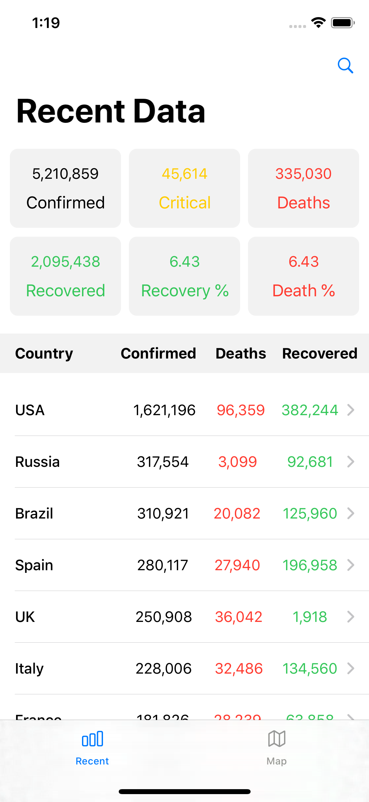
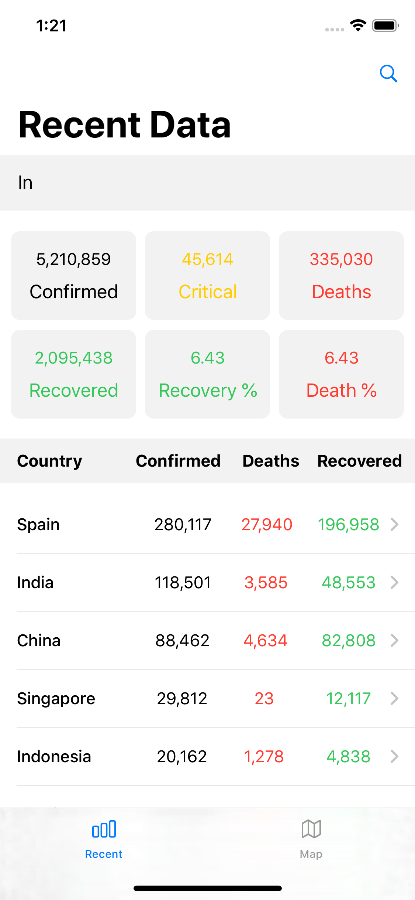
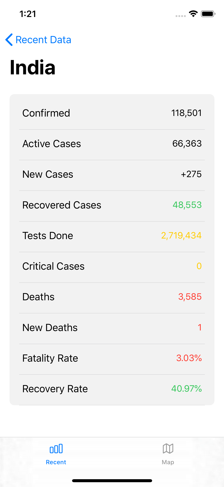
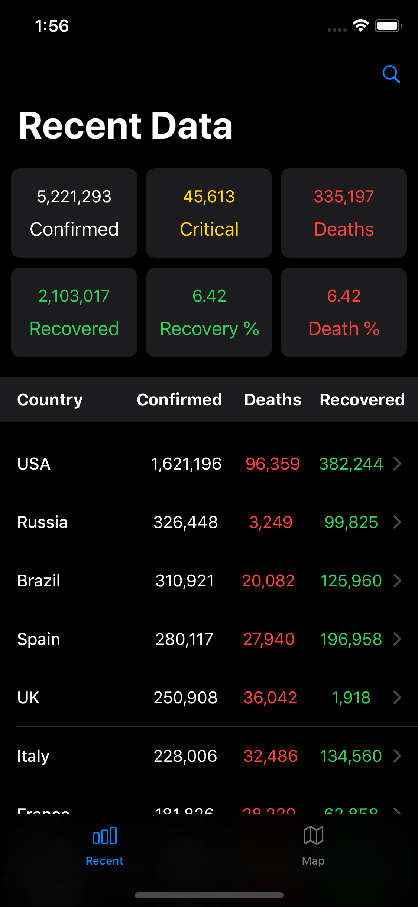
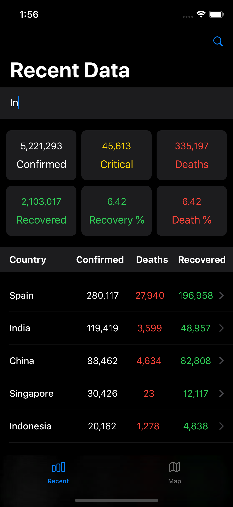
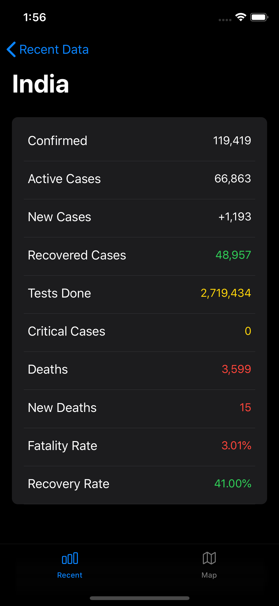
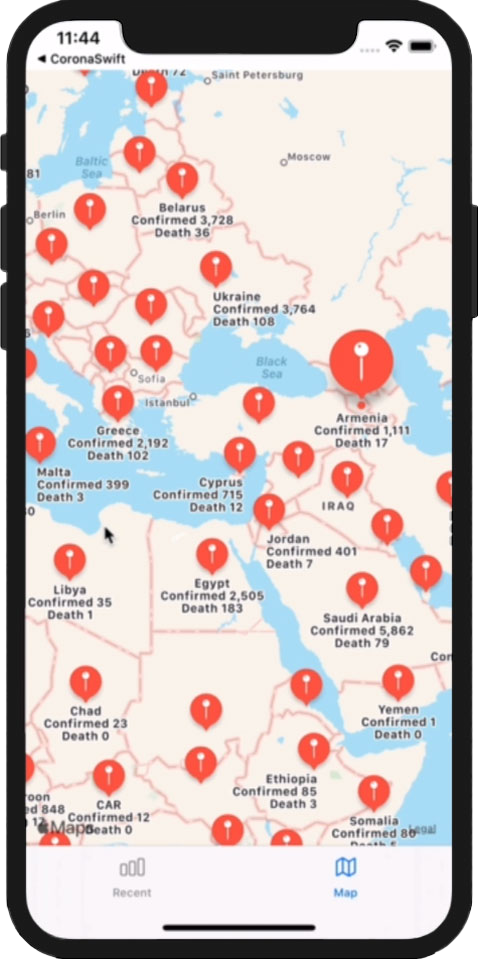
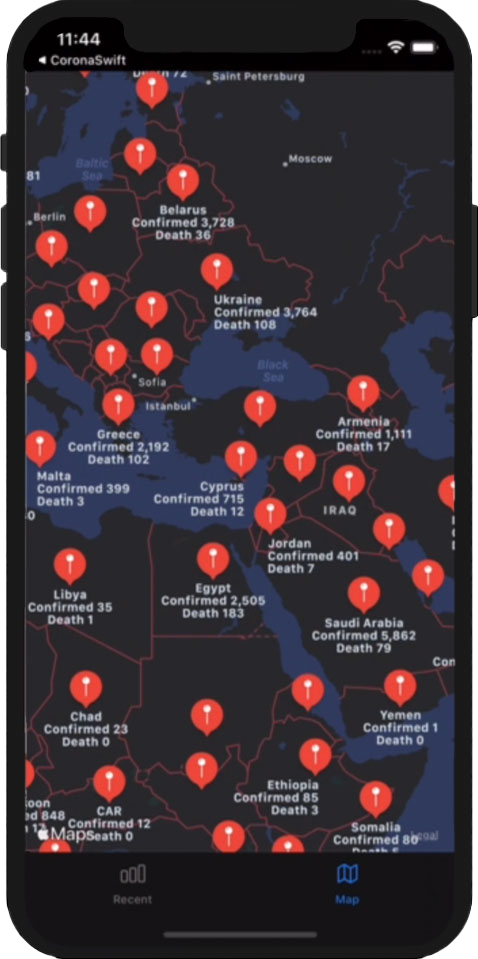

## COVID-19-Stats-Xcode-App
It's a COVID-19 Statistics displayer app that shows realtime statistics which is updated every 15-minutes. The data is fetched from two different APIs adn displayed on the app with variety of differentiations. 

## Motivation
It is a personal project developed by me in Xcode using Swift5. It is basically developed for learning new skill in Xcode by having a overview on the language and implementing the experience.

## Tech/framework used

<b>Built with</b>
- [Xcode](https://developer.apple.com/xcode/)
- [Swift5](https://swift.org/blog/swift-5-released/)

## Screenshots

 &emsp;&emsp;
 &emsp;&emsp;

 &emsp;&emsp;
 &emsp;&emsp;

 &emsp;&emsp;

## License
[MIT](https://choosealicense.com/licenses/mit/)
